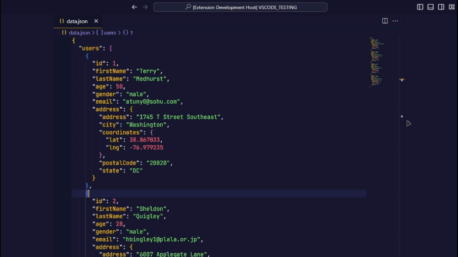
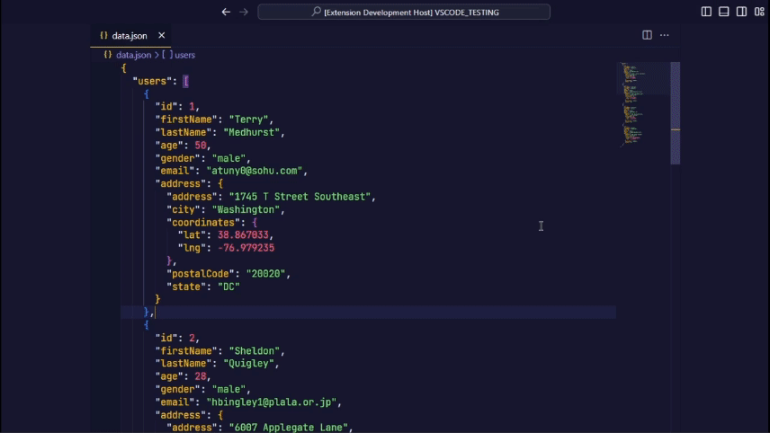

# JSON to TS

JSON to TS is an extension that converts JSON files to TypeScript interfaces, making them easier to work without leaving the editor.

## Features

- Easy Conversion: Convert JSON data to TypeScript interfaces with just one click, without any effort at all.
- Support for Complex Structures: Easily manage nested JSON structures.
- Accurate Type Definitions: Generate TypeScript interfaces with precise type definitions for your data.
- Improved Readability: Use TypeScript interfaces to make code more readable and maintainable.
- Works seamlessly with your current Visual Studio Code workflow, allowing for seamless integration.

## Usage

### With right click

1. Select the JSON data you want to convert.
2. Right click on the code and search for "Convert JSON to TS".
3. Click on the command to generate TypeScript interfaces from the selected JSON data.

### With command palette

1. Select the JSON data you want to convert.
2. Open the command palette (Ctrl/Cmd + Shift + P) and search for "Convert JSON to TS".
3. Click on the command to generate TypeScript interfaces from the selected JSON data.

## Known Issues

- No known issues at the moment.

## Release Notes

### 1.0.0

Initial release of the extension

---

Enjoying the _JSON to TS_ extension? Share your feedback! Your support is greatly appreciated.
